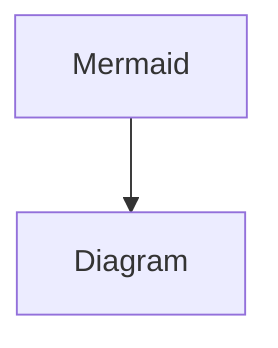

# Page

pasdfasdf

## asdfasdf

### asdfasdf


#### asdfasdf


* asdfasdf
* asdfasdf

1. safasfd
2. asdfasdf


* [ ] asdfasdf
* [ ] asdfasdf

***



asdfasdf



> asdfasdf

```
// Some codeasdf


```



$$
f(x) = x * e^{2 pi i \xi x}
$$

|   |   |   |
| - | - | - |
|   |   |   |
|   |   |   |
|   |   |   |

<table data-view="cards"><thead><tr><th></th></tr></thead><tbody><tr><td></td></tr></tbody></table>











<details>

<summary>asdf</summary>

asdfasdf

</details>




### step1

CONTENT



### STEP 2

CONTENT






## ASDFASDF

ASDFASDF



##





##







[OpenAPI gitbook-petstore](https://gitbookio.github.io/onboarding-template-images/gitbook-petstore.yaml)















```javascript
const message = "hello world";
console.log(message);
```



```python
message = "hello world"
print(message)
```



```ruby
message = "hello world"
puts message
```


